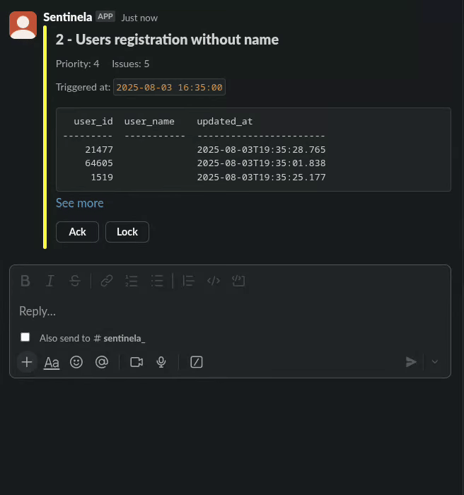
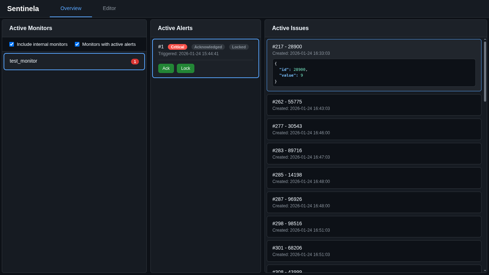
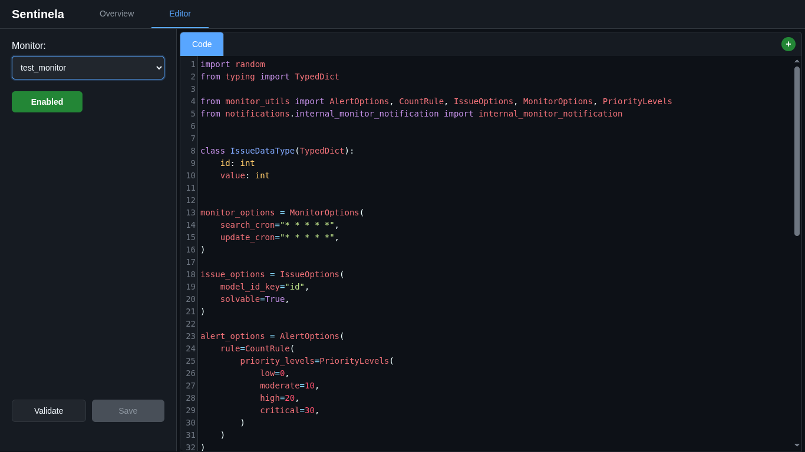

# Sentinela monitoring platform
> [!IMPORTANT]
> **This application is not intended to replace, and will not replace, your current observability stack.**

The Sentinela monitoring platform was created to cover a special case of monitoring that is hardly solved by the usual observability and monitoring tools. It's main purpose is to help teams to identify issues through data that is not easily obtained by logs or similar metrics.

# Use case
Sentinela is designed to provide users with the ability to implement custom Python code that will be used to search, update and check if detected issues are solved. It excels when information is not easily accessible through conventional logs or metrics, such as querying databases or APIs, or when complex logic is required to retrieve and interpret the necessary data.

The platform is developed to track and update **issues**, which are unique units of a problem. When monitoring invalid **user** data, an issue will represent an **user**. When tracking failed **transactions**, each issue represents a specific **transaction**.

A Sentinela Monitor is configured through 3 main parts, along some basic settings:
1. **Data Retrieval and Issue Detection**: Define how to get the information and what’s considered an issue.
2. **Issue Updates**: Specify how to update the information of identified issues.
3. **Issue Resolution**: Define the criteria that determine when an issue is considered resolved.

These implementations are enough for Sentinela to autonomously execute monitoring logic and automatically manages the issues.



## Example scenario: Pending orders with completed shipments
Consider an online store where an order is expected to transition to `completed` as soon as its shipment is marked `completed`. Occasionally, inconsistencies arise: the shipment finishes but the order status remains stuck as `awaiting_delivery` or other intermediate state.

This inconsistency is hard to catch with conventional logs or simple metrics because it requires correlating the current state of two entities (orders and shipments) and enforcing a business rule that the order must be updated when the shipment is done.

Sentinela addresses this by allowing you to configure a monitor that queries for orders whose status is still `awaiting_delivery` while the related shipment is already `completed`. When found, the monitor can alert the responsible team to reconcile the state or fix the update flow.

Once an inconsistent order is detected, Sentinela will track it and periodically refresh its data using the provided implementations. When the order status transitions to `completed`, the issue is automatically resolved.

Below is a simplified monitor implementation for this scenario and the real implementation will require more configuration and steps. This example focuses only on the core logic of the monitor to demonstrate how it can be used.

```python
# Each issue represents an order that is still "awaiting_delivery" while its related
# shipment is already "completed".

def search():
    # Queries the database to get the pending orders with completed shipments
    # Example:
    #   [
    #     {
    #       "order_id": 123,
    #       "order_status": "awaiting_delivery",
    #     },
    #     ...
    #   ]
    #
    # Example SQL:
    # select
    #   orders.id as order_id,
    #   orders.status as order_status
    # from orders
    #   left join shipments
    #     on shipments.order_id = orders.id
    # where
    #   orders.status != 'completed' and
    #   shipments.status = 'completed';
    issues = get_orders_still_awaiting_with_completed_shipments()
    return issues

def update(issues):
    # Refreshes order status for the provided order IDs
    #
    # Example SQL:
    # select
    #   orders.id as order_id,
    #   orders.status as order_status
    # from orders
    # where
    #   orders.id in (<list_of_order_ids>);
    order_ids = [issue["order_id"] for issue in issues]
    updated_issues = get_orders_status(order_ids)
    return updated_issues

def is_solved(issue):
    # The issue is resolved when the order status transitions to 'completed'
    return issue["order_status"] == "completed"
```

This is a simplified example. Sentinela’s open, function-based monitor structure offers the flexibility to build more sophisticated checks: combine multiple data sources, perform multi-step validations, reconcile state machines and tailor resolution criteria to complex business rules.

## Monitoring state machines
where it is crucial to track and verify the consistency of an entity's state. This is especially useful in scenarios where processes involve multiple transitions between states, and business logic must be enforced.

Common use cases:
- **Detecting Invalid States**: Identify when a process enters an invalid or unexpected state according to predefined business logic.
- **State Transition Monitoring**: Ensure that state transitions occur as expected and that no erroneous states are introduced.

State machine-related issues often require several data checks and conditional logic to identify. These issues are typically difficult to capture using standard logs and metrics but can be easily addressed using Sentinela Monitoring.

# Dashboard
Sentinela provides a web dashboard with 2 sections:
1. an overview of the monitors and their alerts and issues
2. a monitor editor, where you can create and edit monitors directly from the browser

**Overview**


**Editor**


# Documentation
1. [Overview](./docs/overview.md)
2. [Building a Monitor](./docs/monitor.md)
    1. [Sample Monitor](./docs/sample_monitor.md)
3. [Querying data from databases](./docs/querying.md)
4. [Validating a monitor](./docs/monitor_validating.md)
5. [Registering a monitor](./docs/monitor_registering.md)
6. Deployment
    1. [Configuration](./docs/configuration.md)
    2. [Configuration file](./docs/configuration_file.md)
    3. [How to run](./docs/how_to_run.md)
7. [Monitoring Sentinela](./docs/monitoring_sentinela.md)
8. [Plugins](./docs/plugins/plugins.md)
    1. [AWS](./docs/plugins/aws.md)
    2. [Postgres](./docs/plugins/postgres.md)
    3. [Slack](./docs/plugins/slack.md)
9. Interacting with Sentinela
    1. [HTTP server](./docs/http_server.md)
10. Special cases
    1. [Dropping issues](./docs/dropping_issues.md)
