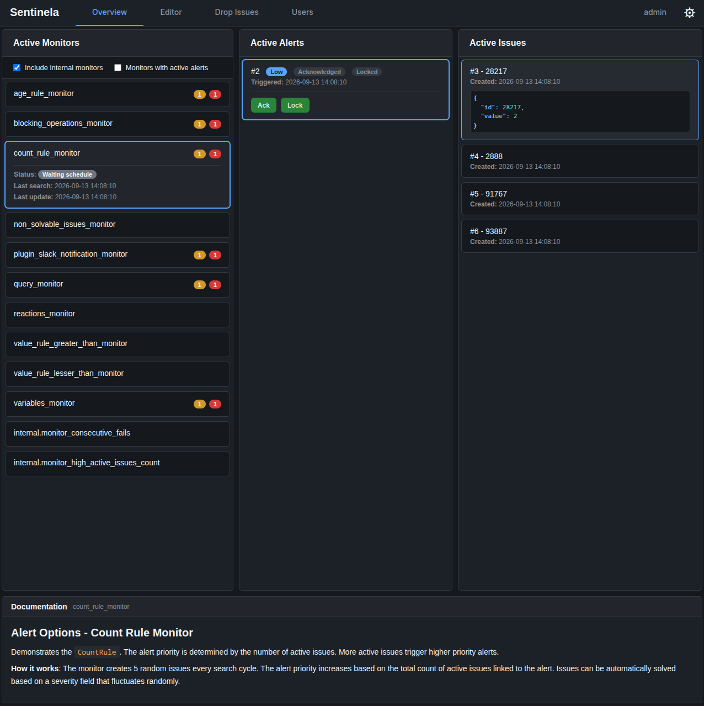
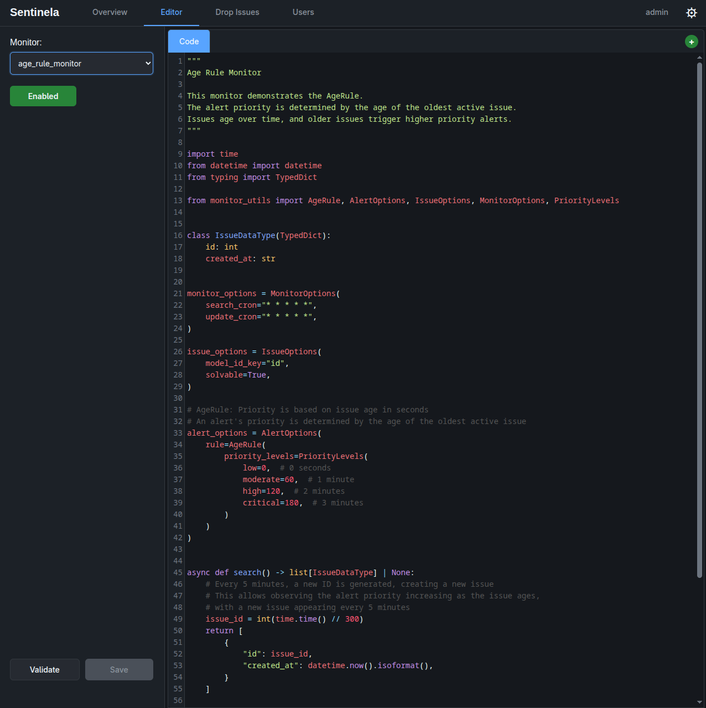

# Sentinela: Business-Logic, Data-Consistency and State-Machine Monitoring with Python

**Sentinela answers "Is the business behaving correctly?"**

Sentinela is a monitoring platform for **business invariant monitoring**: detect business rule violations and data inconsistencies that require correlating data across databases/APIs, applying custom logic, and tracking each affected entity until resolved.

If the problem can be expressed as *"a Python function returning a list of failing entities"*, via SQL, API calls, files, or any Python code joining multiple sources, Sentinela fits.

## What Sentinela does

Write three Python functions per monitor: Sentinela schedules, tracks, alerts, and auto-resolves:

1. **`search()`**: find current issues (e.g. orders stuck in `awaiting_delivery` while shipment is `completed`).
2. **`update(issues)`**: refresh data for active issues by ID (fast, keyed lookup).
3. **`is_solved(issue)`**: return `True` when the entity is back to normal. Issue auto-closes.

Each issue is one entity: one order, one user, one transaction, one payment provider. Alerts aggregate issues by age, count, or value, with P5 to P1 priority levels, acknowledge/lock, and notifications.

See [Monitor lifecycle](docs/monitor_lifecycle.md) and [Building a Monitor](docs/monitor.md).

## Key features

- **Custom Python monitors**: any logic, any library, SQL/API/multi-step validation, state machines.
- **Entity-level issue tracking**: one issue per order/user/transaction, with full history, auto-update, auto-resolve.
- **Flexible alerting**: `AgeRule`, `CountRule`, `ValueRule`, priority levels, acknowledge, lock.
- **Flexible notifications**: be notified in many different ways through customizable notification plugins. Slack notification plugin already available.
- **Reactions**: async callbacks on events. Customize monitor behavior per monitor/issue/alert/notification events.
- **Plugins**: extend Sentinela functionality (AWS SQS, Postgres, ODBC, Slack, custom). See [Plugins](docs/plugins/plugins.md).
- **Web dashboard (`:8000`)**: monitors/alerts/issues overview + in-browser monitor editor.
- **HTTP API, CLI, variables, file helpers**: automate monitor registration, persist monitor-level state.
- **Resilient restarts**: with persistent PostgreSQL storage, monitor and issue state survives application restarts, while Sentinela's internal monitoring detects and repairs eventual inconsistencies.
- **Production-ready ops**: controller + horizontally scalable executors, cron scheduling, Docker / Kubernetes templates, Prometheus metrics and structured logs.

## Use cases: when to use Sentinela

Search terms people use for this category: *business invariant monitoring, business process monitoring, data quality monitoring, database consistency monitoring, entity-level issue tracking, cross-system validation, automated reconciliation, state-machine monitoring*.

Sentinela excels when:

- Data comes from **DB rows, API responses, business events**: not CPU/latency/logs.
- Each occurrence is a **distinct entity to track**: e.g. "user 123 charged twice".
- Logic needs **joins across 2+ sources, state machines, multi-step checks**.
- Resolution is detectable: e.g. invoice appears → issue closes.
- System fails **silently** (no error log / metric spike).

Common examples:

- **Orders stuck in processing**: paid but never shipped; `awaiting_delivery` order with `completed` shipment.
- **Invoices not generated**: subscription renewed, no invoice row.
- **Users charged twice**: payments vs refunds mismatch.
- **Failed reconciliation**: settlement totals vs transaction records.
- **Invalid registration data**: users with `NULL` / malformed fields.
- **State-transition violations**: entity skipped `invoiced`, stuck in `approved`, entered invalid state.

See [When to use Sentinela](docs/when_to_use_sentinela.md) for a detailed comparison with traditional observability tools and guidance on choosing the right combination.

## Example: pending orders with completed shipments

In this scenario, an order is expected to transition to `completed` after its shipment is completed. Occasionally, the order remains in `awaiting_delivery` without generating a log entry, making the inconsistency visible only through a join between the order and shipment data.

```python
# Each issue represents an order that is still "awaiting_delivery" while its related
# shipment is already "completed".

def search():
    # Queries the database to get the pending orders with completed shipments
    # Example:
    #   [
    #     {
    #       "order_id": 123,
    #       "order_status": "awaiting_delivery",
    #     },
    #     ...
    #   ]
    #
    # Example SQL:
    # select
    #   orders.id as order_id,
    #   orders.status as order_status
    # from orders
    #   left join shipments
    #     on shipments.order_id = orders.id
    # where
    #   orders.status != 'completed' and
    #   shipments.status = 'completed';
    issues = get_orders_still_awaiting_with_completed_shipments()
    return issues

def update(issues):
    # Refreshes order status for the provided order IDs
    #
    # Example SQL:
    # select
    #   orders.id as order_id,
    #   orders.status as order_status
    # from orders
    # where
    #   orders.id in (<list_of_order_ids>);
    order_ids = [issue["order_id"] for issue in issues]
    updated_issues = get_orders_status(order_ids)
    return updated_issues

def is_solved(issue):
    # The issue is resolved when the order status transitions to 'completed'
    return issue["order_status"] == "completed"
```

Sentinela tracks each order individually, periodically refreshes its state according to `update_cron`, and resolves the issue once the order reaches `completed`. The same approach supports multi-source joins, state-machine checks, and multi-step validation. See the [monitor template](resources/monitor_template.py) for a starting point.

## Sentinela vs Prometheus / Grafana / Datadog

| Use case | Sentinela | Prometheus / Grafana | Datadog / New Relic |
|---|---|---|---|
| Orders stuck in processing | Native: query orders + shipments, track each order | Needs custom exporter | Needs custom metric + instrumentation |
| Invoices not generated | Native: poll DB, resolve when invoice appears | Needs app metric | Needs custom event |
| Users charged twice | Native: cross-reference payments + refunds | Not detectable via infra metrics | Needs custom submission |
| API p99 latency spike | Not for this: no metric ingestion | Native | Native APM |
| CPU / disk / 5xx rate | Not for this | Native | Native |

Rule of thumb ([details](docs/when_to_use_sentinela.md)):

1. Single SQL/API call returns failing entities? → Sentinela.
2. Specific entity (order/user/transaction) vs aggregate (p95/avg/rate)? Entity → Sentinela.
3. Multi-state business logic? → Sentinela.
4. Join across 2+ systems? → Sentinela.
5. Silent failure, no metric? → Sentinela.

Best setup: both. Prometheus catches latency/DB saturation; Sentinela catches slipped business invariant. Example in [When to use both together](docs/when_to_use_sentinela.md#when-to-use-both-together).

## Quickstart

The local setup requires Docker and starts the dashboard on port `8000`.

```shell
# Migrate the database before the first run and after application updates.
make migrate-local

# Start Sentinela with a local PostgreSQL database.
make run-local
```

After the application starts, open `http://localhost:8000` to explore the included example monitors or create your own using the editor and the [monitor template](resources/monitor_template.py). See the [Example Monitors](docs/example_monitors.md) guide for an overview of the available examples.

Continue with:

- [Building a Monitor](docs/monitor.md), [Validating a monitor](docs/monitor_validating.md), and [Registering a monitor](docs/monitor_registering.md)
- [Querying databases](docs/querying.md), including `DATABASE_USERS=postgres://...` and `await query("users", sql)`
- [Configuration](docs/configuration.md), [How to run](docs/how_to_run.md) for single-container, scalable, and Kubernetes deployments, and [Recommendations](docs/recommendations.md)
- [Command line interface](docs/command_line_interface.md), [HTTP server](docs/http_server.md), and [Monitoring Sentinela](docs/monitoring_sentinela.md) with Prometheus metrics

## Dashboard

The dashboard provides two main views: an overview of monitors, alerts, and issues, plus an editor for creating and managing monitors.

**Overview**


**Editor**


## Documentation

1. [When to use Sentinela](docs/when_to_use_sentinela.md)
2. [Overview](docs/overview.md)
3. [Building a Monitor](docs/monitor.md)
    1. [Monitor lifecycle](docs/monitor_lifecycle.md)
    2. [Example Monitors](docs/example_monitors.md)
4. [Querying data from databases](docs/querying.md)
5. [Validating a monitor](docs/monitor_validating.md)
6. [Registering a monitor](docs/monitor_registering.md)
7. Deployment
    1. [Configuration](docs/configuration.md)
    2. [Configuration file](docs/configuration_file.md)
    3. [How to run](docs/how_to_run.md)
    4. [Recommendations](docs/recommendations.md)
8. [Command line interface](docs/command_line_interface.md)
9. [Monitoring Sentinela](docs/monitoring_sentinela.md)
10. [Plugins](docs/plugins/plugins.md)
    1. [AWS](docs/plugins/aws.md)
    2. [ODBC](docs/plugins/odbc.md)
    3. [Postgres](docs/plugins/postgres.md)
    4. [Simple Queue](docs/plugins/simple_queue.md)
    5. [Slack](docs/plugins/slack.md)
11. Interacting with Sentinela
    1. [HTTP server](docs/http_server.md)
12. Special cases
    1. [Dropping issues](docs/dropping_issues.md)
