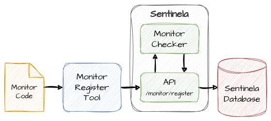

# Registering a monitor
Once the monitor code has been created, it needs to be registered on Sentinela. The process for registering a new monitor or updating an existing one is the same.



## Monitor Composition
A monitor consists of:
- **Main Code File**: The `.py` file containing the monitor's definition.
- **Optional Additional Files**: Supporting resources used during the monitor's execution, such as SQL query files or other data files.

## Registration Process
```
POST monitors/register/{monitor_name}
```

Parameters:
- `{monitor_name}` is the name of the monitor being created or updated.

The payload should include the following fields:
- `monitor_code`: The content of the monitor’s main `.py` file content.
- `additional_files`: Optional field with an object where the keys are the names of additional files, and the values are their content.

Example:
```json
{
    "monitor_code": "...",
    "additional_files": {
        "search_query.sql": "select * from users where id = $1;"
    }
}
```

## Responses
The response will contain the status of the registration process. The field `status` will be set to `monitor_registered` if the monitor was successfully registered and the monitor id will be in the `monitor_id` field.

Example:
```json
{
    "status": "monitor_registered",
    "monitor_id": 123
}
```

If the registration fails, the `status` field will be set to `error` and the field `message` will contain the error message. Depending on the error, additional fields may be present to help diagnose the issue.

Example:
```json
{
    "status": "error",
    "message": "Module didn't pass check",
    "error": "Monitor 'my_monitor' has the following errors:\n  'monitor_options' is required"
}
```

## Monitor register tool
To simplify the registration process, a Python script is available in the `tools` folder.

The following example demonstrates how to use the script to register a new monitor:

```bash
register_monitor \
    my_monitor \
    monitors/my_monitor/my_monitor.py \
    monitors/my_monitor/search_query.sql \
    monitors/my_monitor/update_query.sql
```

In this example:
- `my_monitor` is the name of the monitor being registered.
- `monitors/my_monitor/my_monitor.py` is the main monitor file.
- `monitors/my_monitor/search_query.sql` and `monitors/my_monitor/update_query.sql` are additional files used by the monitor.

## Monitor execution
Once registered, Sentinela will load all registered monitors during its next monitor load cycle. This cycle is determined by the `monitors_load_schedule` setting in the `configs.yaml` file.
