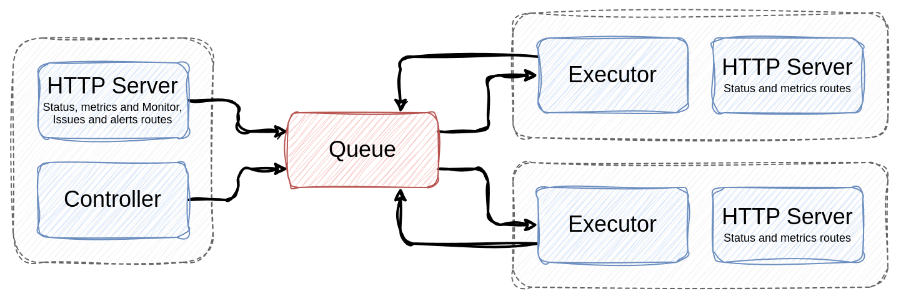
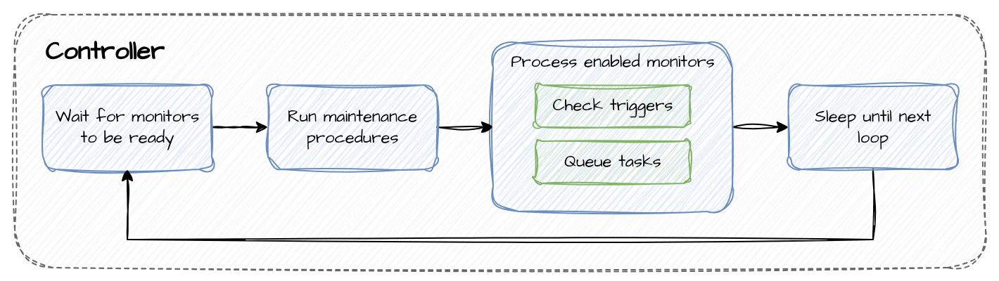
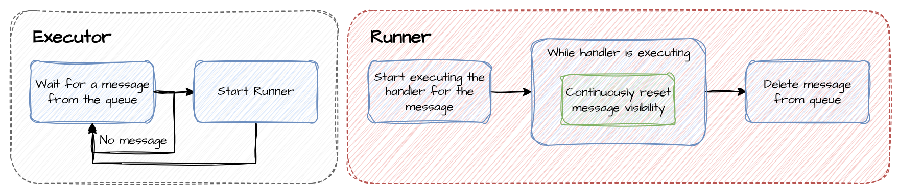
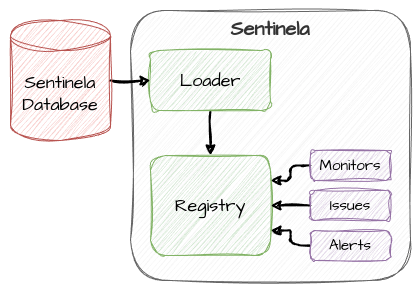
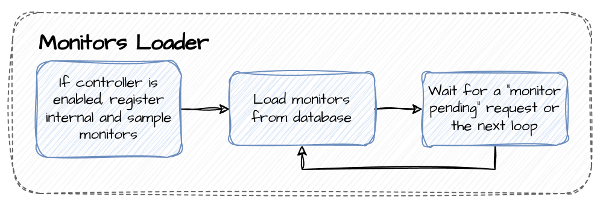

# Main Elements
The Sentinela monitoring platform is structured around three main elements:
1. Monitors
2. Issues
3. Alerts

## Monitors
Monitors define the logic and rules for observing specific conditions and managing related issues and alerts on the platform. Any information accessible through Python code can be monitored by Sentinela.

## Issues
Issues represent individual instances of problems, each relating to a specific entity or event that can be monitored. Examples include:
- A **user** with invalid registration details (each issue corresponds to a different user).
- A **transaction** that remains in a specific state for too long (each issue corresponds to a distinct transaction).
- An **item** pending processing beyond a designated time (each issue represents a specific item).

To uniquely identify each issue, it is essential to assign a unique identifier to each one, which enables precise differentiation.

## Alerts
Alerts are aggregations of issues that collectively determine the alert’s priority level. Alerts can also trigger notifications based on configuration settings.

Each alert can be acknowledged, indicating that someone has recognized the alert's priority level. Acknowledgment is level-specific; if the priority level increases to one that hasn't been acknowledged, the alert will be considered as **not acknowledged**.

Example: An alert is acknowledged at priority level P3. If the priority rises to P2, the alert is not acknowledged at this level.

Alerts can also be locked. Locking an alert prevents additional issues from being linked to it. This feature enables the platform to generate new alerts for new issues when required.

Example: An active alert has been acknowledged. To ensure visibility of new issues, the user can lock the existing alert. If new issues are detected, they will be linked to a new alert if one is triggered.

# Platform Components
The Sentinela platform comprises four main components:
- Controller
- Executor
- HTTP Server
- Monitors Loader

## Controller
The controller orchestrates the processing of monitors, queuing them for execution as needed.

The controller execution is demonstrated in the following diagram.

## Executor
The executor handles the actual execution of monitor routines, as well as responses to requests and events. It performs the platform’s core processing tasks and can be scaled horizontally to enhance processing capacity.

The executor execution is demonstrated in the following diagram.

The executor will wait for a message in the queue and do nothing while none are available. When a message is received, the executor will process it using the correct handler.

The possible handlers are:
- `monitor`: Executes the monitor routine.
- `event`: Executes the reactions for events that were triggered during the monitor execution.
- `request`: Executes the requests that were queued by an entity.

During the handling of a message, the executor will continuously reset the message visibility in the queue to prevent it from being processed by another executor. After the message is processed, the executor will delete it from the queue.

## HTTP Server
As the name suggests, the HTTP server serves as an entry point for user requests and actions on the platform. While not all interactions must occur through the HTTP server, it provides a central access point for user actions.

More information can be found in the [HTTP Server](./docs/http_server.md) documentation.

## Monitors Loader
The monitors loader loads the monitors from the database and registers them to be used by the other components.

The monitors loader execution is demonstrated in the following diagram.

The monitors loader registers internal and sample monitors (if configured as such) to the database. This process is only executed when the controller is enabled in the execution to make sure only one instance is trying to register the same monitors.

While waiting for the next loading cycle, some components can request for the monitors to be loaded again before waiting for the next cycle. One example where this might happen is if the executor receives a message for a monitor that is not loaded yet. This issue can occur if the monitor already loaded new monitors from the database but the executor is behind in the loading process.

The sleeping process for the next loading cycle has an **early load time** that can be configured to load the monitors before the next cycle. This mechanism tries to prevent problems where the controller starts a cycle before the monitors are reloaded from the database or the executor receives a message for a monitor that is not loaded yet.
