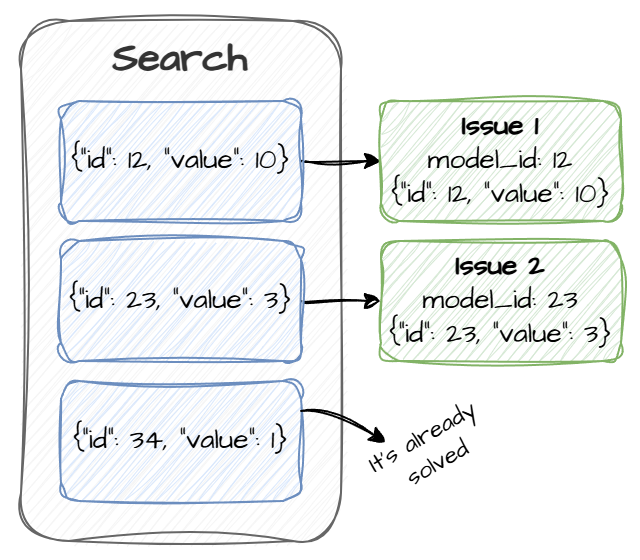
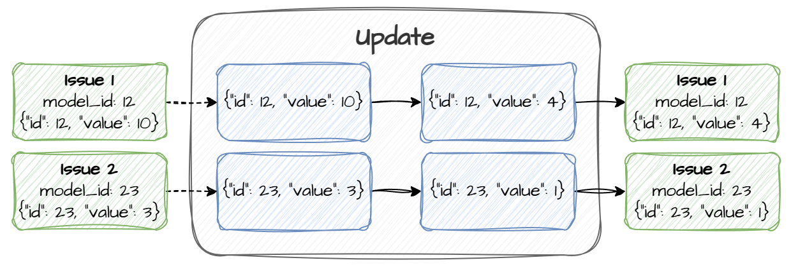
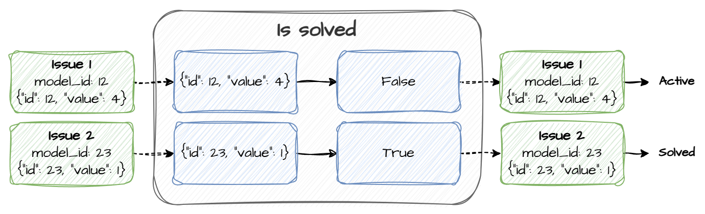

# Sample monitor
This documentation explains the processes executed by the Sentinela monitoring platform, focusing on searching for issues, updating their data, and identifying when issues are solved. The provided [Sample Monitor](../sample_monitors/test_monitor/test_monitor.py) serves as an example implementation to understand these processes.

## Issue options and issue data type
Each issue is expected to have two fields:
- `id`: A unique identifier for each issue.
- `value`: A numeric field.

The `issue_options` configuration `model_id_key` specifies that the `id` field will serve as the identifier for issues. **Different data with the same `id` represent the same issue**.

## Search process

Sentinela calls the `search` function, which returns a list of **issues data**. Each issue data contains the `id` and `value` fields and is generated randomly.

Example of returned issues data:
- `{"id": 12, "value": 10}`
- `{"id": 23, "value": 3}`
- `{"id": 34, "value": 1}`

Sentinela filters out issues considered solved. An issue is considered solved if its `value` meets the resolution criteria (e.g., `value = 1` in this case). Remaining issues data are used to create **Issue** objects, assigned a `model_id` equal to the `id` of each issue data, and stored in the database.

In the example:
- Issues with data `{"id": 12, "value": 10}` and `{"id": 23, "value": 3}` are created.
- The issue with `{"id": 34, "value": 1}` is discarded.

## Update process

Sentinela retrieves the **issues data** for all active issues in the Monitor. This data includes the `id` and `value` fields for each active issue.

The **update** function updates the data accordingly and returns it. Sentinela will, then, use this information to update the **Issues**.

Example of updates:
- `{"id": 12, "value": 10}` is updated to `{"id": 12, "value": 4}`
- `{"id": 23, "value": 3}` is updated to `{"id": 23, "value": 1}`

Sentinela maps the updated **issues data** to their respective **Issue** objects by their `model_id` and the `id` field in the data. The corresponding Issues are updated in the database with the new `value`.

## Solve process

Similar to the update process, Sentinela retrieves **issues data** for all active issues.

The `is_solved` function is executed for each issue data to determine whether it is solved.

Example of resolution checks:
- For `{"id": 12, "value": 4}`, the function returns `False`.
- For `{"id": 23, "value": 1}`, the function returns `True`.

Any issue detected as solved (i.e., `is_solved` returns `True`) has its status changed to `solved`, and it is no longer considered as active.
